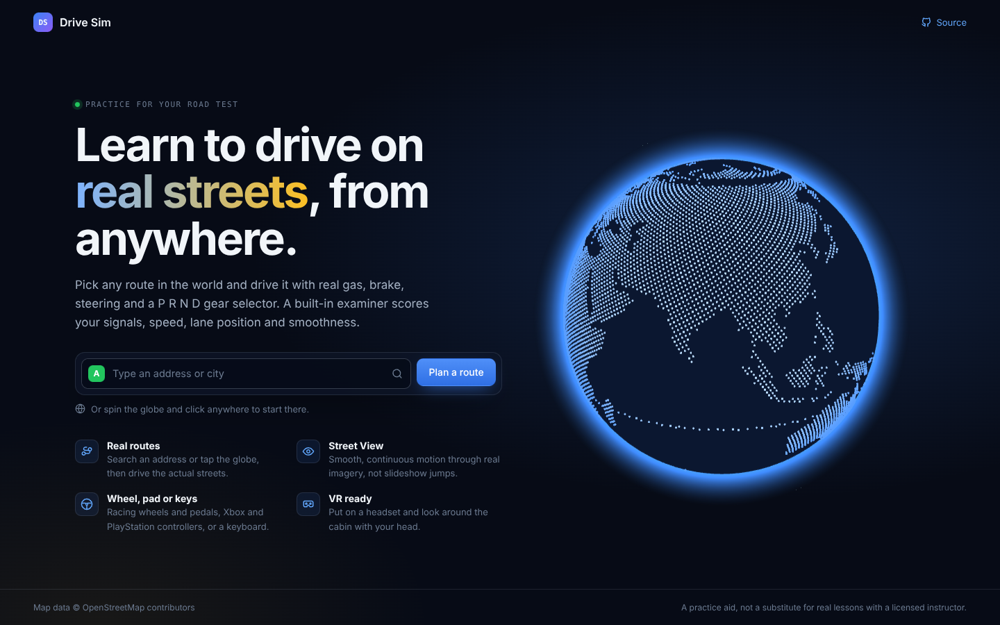
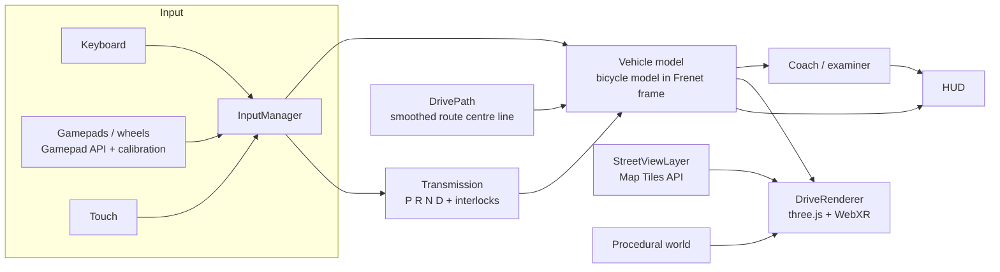
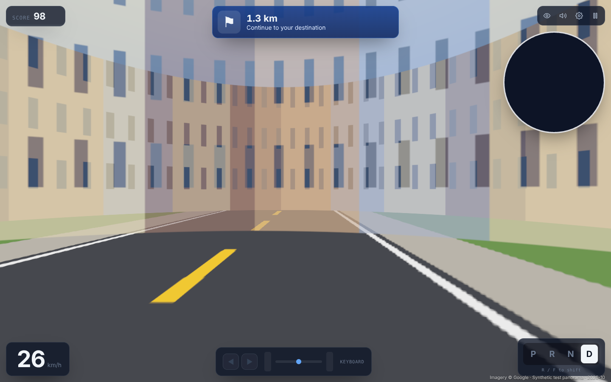

# Drive Sim

**Practise for your driving test on real streets, from anywhere.** Plan a route anywhere in the world, then
drive it through real 360° street photos with a gas pedal, brake, steering and a real `P R N D` gear
selector. A built-in examiner scores you the way a road-test examiner would. Free to run: imagery comes from
[Mapillary](https://www.mapillary.com) by default, with Google Street View as an optional upgrade.

Live at **[andrewjeanette.com/portfolio/driving-simulator](https://andrewjeanette.com/portfolio/driving-simulator/)** · MIT licensed · no install, runs in
the browser



## Features

|                                 |                                                                                                                                                                                                                      |
| ------------------------------- | -------------------------------------------------------------------------------------------------------------------------------------------------------------------------------------------------------------------- |
| **Real routes**                 | Type an address (with autocomplete), or spin the 3D globe and click anywhere to start there. Routes are snapped to real roads with turn-by-turn directions.                                                          |
| **Photorealistic 360° imagery** | Free Mapillary panoramas (or Google Street View with a key), rendered in WebGL so the car glides smoothly between photos instead of jumping. Imagery preloads ahead of the car like a game's render distance.        |
| **Real driving controls**       | Gas, brake and steering with a physics model. Automatic transmission with `P R N D` in standard lever order, a brake-shift interlock, idle creep in D and R, and a refusal to shift into P or R while moving.        |
| **Any controller**              | Keyboard, Xbox, PlayStation and other standard gamepads out of the box. Racing wheels and pedal sets (Logitech, Thrustmaster, Fanatec, Moza…) through a 30-second calibration wizard. Touch controls on phones.      |
| **VR**                          | One click into WebXR on Quest, Vision Pro or SteamVR headsets. Look around the cabin with your head; the instrument cluster and directions are readable in the headset.                                              |
| **Driving examiner**            | Scores turn signals (and which side), speeding against posted limits, crossing the centre line, hitting the curb, harsh braking or acceleration, cornering speed and coasting in neutral. Ends with a graded report. |
| **Costs nothing**               | OpenStreetMap search and routing plus Mapillary imagery need no billing account. With no token at all it falls back to a generated 3D road, so anyone can clone and run it.                                          |

## How it works



### Smooth motion through 360° photos

A street-level panorama is a single 360° photo taken from one point, roughly every 2 to 15 m along a road.
Showing them one after another looks like a slideshow. Drive Sim does this instead:

1. It looks up panoramas along the route ahead of the car and streams them into textures, starting low
   resolution and sharpening as the car gets close. For Mapillary, where several contributors often captured
   the same street, it picks one photo every ~6 m and favours staying on one sequence (no flicker between
   years or directions), then closeness to the road, then recency.
2. A fragment shader treats each photo as a projection onto a simple model of a street: a **ground plane**
   for the road, plus a **cylinder** standing in for building fronts. For every pixel it casts a ray from the
   car's actual position, finds where the ray hits that model, and looks up the colour the panorama recorded in
   that direction.
3. It projects the panorama behind the car and the one ahead at the same time, and cross-fades between them
   as the car moves.

The result is that lane markings flow under the car and buildings grow as you approach, with continuous
parallax. Because this is ordinary geometry in the scene, it renders per eye in a VR headset too. See
`src/render/streetview.ts`.

Both providers sit behind one `PanoSource` interface (`src/providers/imagery.ts`), so the renderer doesn't
know or care where the photos come from.

### Render distance that stretches with speed

Like chunk loading in an open-world game, imagery is kept loaded in a window around the car, but stretched
along the road in the direction of travel. The window reaches about **8 seconds of driving ahead** (60 m when
parked, about 170 m at 30 mph, 300 m at 70 mph, capped at 450 m) and keeps only a short tail behind; it flips
when you reverse. Inside the window, panoramas use **level-of-detail rings**: full resolution within 35 m,
medium out to 150 m and low beyond, upgrading as you approach. Lookups for which panoramas exist run another
600 m beyond that. The HUD shows how many metres ahead are buffered. See `loadWindow()` in
`src/render/streetview.ts`.


<sub>Renderer test with synthetic panoramas served through a stub API; real photos appear with a Mapillary token or Google key.</sub>

### A vehicle model that still needs steering

Street View only exists on roads, so the car is simulated in the road's **Frenet frame**: distance along the
route `s`, lateral offset `d` and heading relative to the road `ψ`, driven by a kinematic bicycle model:

```
ds/dt = v·cos ψ / (1 − κ·d)       dd/dt = v·sin ψ       dψ/dt = v·tan δ / L − κ·ds/dt
```

Road curvature `κ` feeds back into the heading, so a car that isn't steered drifts wide in every bend, exactly
like a real one. Steering assist (off, curves only, or full lane keeping) is a setting. The route itself is
resampled and corner-cut (Chaikin) so 90° intersections become curves you can actually drive. Longitudinal
forces include power-limited traction, aerodynamic drag, rolling resistance, brakes that never push you
backwards, and idle creep. See `src/sim/vehicle.ts` and `src/geo/path.ts`.

### Any controller, any wheel

Standard gamepads follow the W3C "standard" mapping. Racing wheels don't: every brand reports its axes in a
different order and direction, and pedals often rest at `+1` and read `−1` when pressed. The calibration wizard
asks you to turn the wheel and press each pedal, watches which raw channel moves the most, and records its rest
and full-travel values. Profiles are validated and saved per device in `localStorage`. See
`src/input/calibrate.ts`.

## Controls

| Action                              | Keyboard                                                                 | Controller           |
| ----------------------------------- | ------------------------------------------------------------------------ | -------------------- |
| Gas / brake                         | `W` `S` or `↑` `↓` (`Space` = hard brake, hold `Shift` for gentle input) | RT / LT              |
| Steer                               | `A` `D` or `←` `→`                                                       | Left stick, or wheel |
| Shift lever up / down               | `R` / `F` (`1` `2` `3` `4` = P R N D)                                    | D-pad ↑ / ↓          |
| Turn signals / hazards              | `Q` / `E` / `X`                                                          | LB / RB / B          |
| Look around                         | Drag the mouse (double-click resets)                                     | Right stick          |
| Horn · camera · pause · recenter VR | `H` · `C` · `Esc` · `Z`                                                  | L3 · Y · Menu · R3   |

## Run it locally

```bash
git clone https://github.com/drewjeanette/driving-simulation.git
cd driving-simulation
npm install
npm run dev          # http://localhost:5173 (simulated road, no key needed)
```

### Free 360° imagery with Mapillary

1. Sign up at [mapillary.com](https://www.mapillary.com) and open
   [Developers](https://www.mapillary.com/dashboard/developers) → **Register application** with only the
   **READ** scope.
2. Copy the **Client Token** (it starts with `MLY|`). It is meant for browser use. Never use the client secret.
3. Put it in `.env.local` as `VITE_MAPILLARY_TOKEN`, or paste it into **Settings → Map data** in the app.

Mapillary coverage is crowd-sourced: excellent in many cities, patchy elsewhere. The planner shows the
percentage of your route that has 360° photos, and gaps fall back to the simulated road.

### Optional: Google Maps and Street View

1. In [Google Cloud Console](https://console.cloud.google.com/google/maps-apis), create a project with billing
   and enable **Maps JavaScript API**, **Places API (New)**, **Routes API**, **Geocoding API** and
   **Map Tiles API** (the Map Tiles API supplies the Street View imagery).
2. Create an API key and **restrict it**: HTTP referrers (`http://localhost:5173/*`, your domain) and only the
   five APIs above. Set quotas and a budget alert.
3. Copy `.env.example` to `.env.local` and set `VITE_GOOGLE_MAPS_API_KEY`. `.env.local` is git-ignored.

Or paste a key into **Settings → Map data** in the running app; it stays in your browser only.

Google charges per request beyond its free monthly usage, mostly for Street View tiles. Use the **Fast**
quality setting to reduce tile requests.

### Scripts

|                        |                                                                                                                                       |
| ---------------------- | ------------------------------------------------------------------------------------------------------------------------------------- |
| `npm run dev`          | Dev server with hot reload                                                                                                            |
| `npm run check`        | Typecheck, lint and unit tests (what CI runs, plus format and build)                                                                  |
| `npm test`             | Vitest unit tests: vehicle physics, transmission interlocks, examiner rules, route geometry, controller calibration, provider parsing |
| `npm run build`        | Production build into `dist/` with a strict Content-Security-Policy                                                                   |
| `npm run publish:site` | Build for `/portfolio/driving-simulator/` and copy it into the andrewjeanette.com repo                                                |

## Project layout

```
src/
  geo/        coordinates, polyline decoding, the smoothed DrivePath, traffic side
  sim/        vehicle physics, P R N D transmission, driving examiner
  input/      keyboard, gamepad and wheel input, calibration
  render/     three.js renderer and WebXR rig, Street View layer, procedural world, cockpit
  providers/  imagery sources (Mapillary, Google Street View) plus Google and open-data (OSRM, Photon,
              MapLibre) search, routing and maps
  ui/         landing globe, route planner, HUD, settings and report screens
  audio/      synthesised engine, road noise, indicator, horn and chimes (no audio files)
```

## Security

The repo is public, so no keys live in it or in any build. Keys are injected at deploy time and locked to
referrers. Production builds ship a CSP, and third-party text never reaches `innerHTML` (lint-enforced). See
[SECURITY.md](SECURITY.md).

## Limitations and roadmap

- Other traffic, pedestrians, traffic lights and stop signs aren't simulated yet. Street View photos are
  static, so cars in them are frozen. Stop-sign and signal checks from OpenStreetMap data are next.
- The car stays on the planned route; driving off-route to explore freely isn't supported.
- Google's Routes API doesn't return posted speed limits, so speeding checks only run in the free mode
  (OpenStreetMap `maxspeed`) for now.
- Parallel parking and three-point-turn practice modes.
- Rear-view and side mirrors.

## Credits

Map data © OpenStreetMap contributors · Routing by [OSRM](https://project-osrm.org) · Search by
[Photon](https://photon.komoot.io) · Tiles by [OpenFreeMap](https://openfreemap.org) · Land outlines from
[Natural Earth](https://www.naturalearthdata.com) · 360° imagery © [Mapillary](https://www.mapillary.com) contributors (CC BY-SA 4.0) · Imagery and maps © Google when Google mode is enabled.

Built by [Andrew Jeanette](https://andrewjeanette.com). Drive Sim is a practice aid, not a substitute for
lessons with a licensed instructor.
